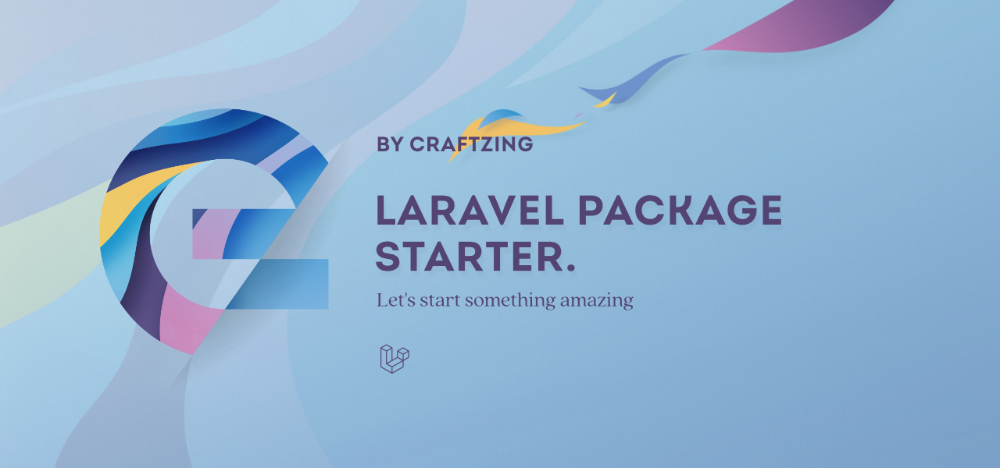

This package serves as a starting point to create a new Laravel package. Everything's in place to get you started 
quickly:
- Documentation outline
- Basic workflows
- Basic config files
- Laravel-specific code starters
- ...

Perform a "search and replace" action for the following placeholders and update them with an according value:
- `laravel-mollie-webhooks`: Please make sure to use lowercase and dashes as a separator (e.g. `my-package`)
- `MollieWebhooks`: Not that the default namespace is already set to be `Craftzing\Laravel` (e.g. `MyPackage`)
- `Handle Mollie webhooks in a Laravel app`
- `Rémi Pelhate`
- `remi.pelhate@craftzing.com`

Replace the banner at the top of this file with one for this package.

Then, replace this section with a short description about what the package does. You can add a short code-snippet if 
you want. From then on, you can start implementing some code, write the docs, ...

## 🔥 Features

- **Short feature title.** Short feature description. Make it sound zazzy!

## 📚 Docs

- [Getting started](/docs/getting-started.md)
- [Usage](/docs/usage.md)

## 📝 Changelog

Check out our [Change log](/CHANGELOG.md).

## 🤝 How to contribute

Have an idea for a feature? Wanna improve the docs? Found a bug? Check out our [Contributing guide](/CONTRIBUTING.md).

## 💙 Thanks to...

- [The entire Craftzing team](https://craftzing.com)
- [All current and future contributors](https://github.com/creaftzing/laravel-mollie-webhooks/graphs/contributors)

## 🔑 License

The MIT License (MIT). Please see [License File](/LICENSE) for more information.
